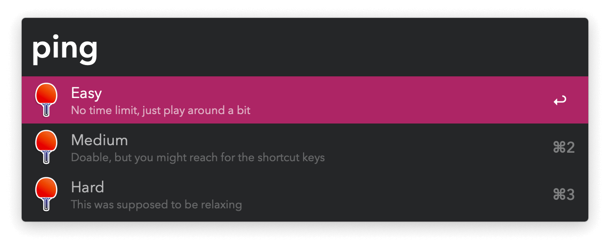
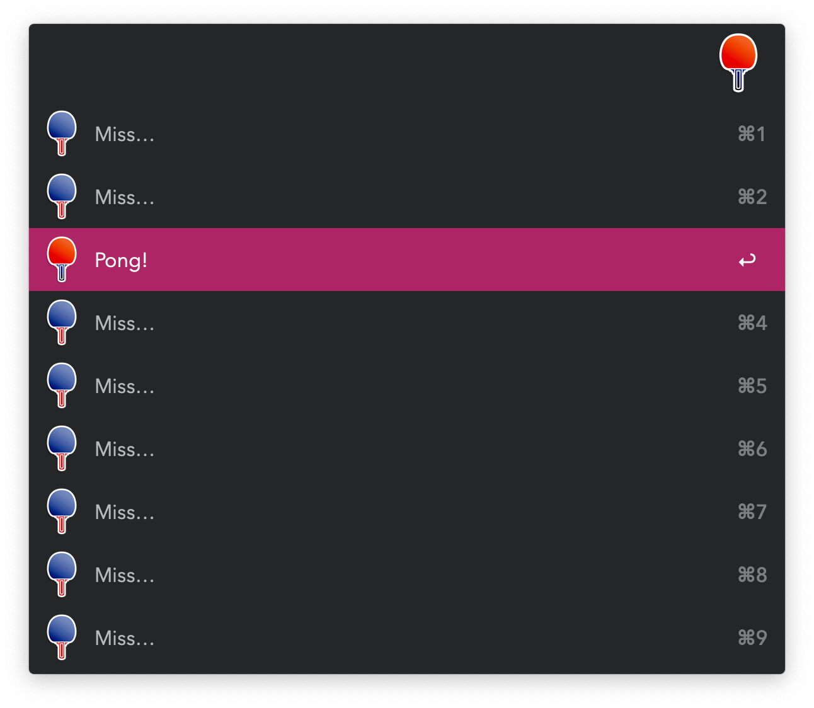
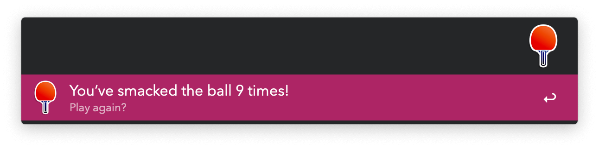

#  Ping Pong Alfred Workflow

Play a round of table tennis

[⤓ Install on the Alfred Gallery](https://alfred.app/workflows/vitor/ping-pong)

## Usage

Start a round of table tennis against Alfred via the `ping` keyword. Hit `Pong!` to continue playing.

If you `Miss…`, the game is over and your score is shown.

